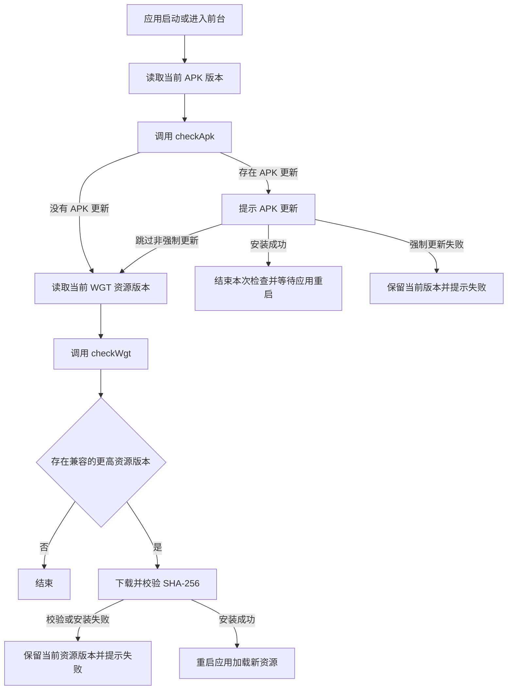

# APP 更新流程说明

本文说明 APP-PLUS Android 客户端的 APK 与 WGT 更新流程。架构决策和开发进度见 [ADR-app-003](adrs/ADR-app-003-app-plus-package-publishing.md)。

## 1. 更新类型

APK 和 WGT 是同一应用下的两条独立发布线，版本编码分别维护，不能互相比较。

| 更新类型 | 用途 | 版本来源 | 发布数据 | 客户端版本来源 |
|---|---|---|---|---|
| APK | 原生代码、权限、插件、SDK 或启动配置变化 | APK 清单 | `app_apk_version` | `plus.runtime.versionCode` |
| WGT | 页面、脚本和静态资源更新 | WGT 内 `manifest.json` | `app_release`、`app_release_package` | `plus.runtime.getProperty` |

WGT 可以设置可选的最低兼容 APK 版本：

- 留空：适用于该应用的所有 APK 版本。
- 填写版本 `N`：仅当 `当前 APK versionCode >= N` 时允许更新。
- WGT 不精确绑定某个 APK，也不要求 APK 版本编码小于 WGT 资源版本编码。

## 2. 发布流程

### 2.1 发布 APK

1. 在“APK 安装包”中上传 APK。
2. 后台解析应用包名、版本名称和版本编码，并保存 APK 历史版本。
3. 填写更新说明，按需设置强制更新。
4. APK 首次参与更新检查时计算并保存 SHA-256，后续检查直接复用。

### 2.2 发布 WGT

1. 在应用的“客户端更新”中选择“上传 WGT 并创建草稿”。
2. 上传 `.wgt` 文件，后台从 `manifest.json` 读取资源版本。
3. 填写更新说明；最低兼容 APK 可以留空或从 APK 历史中选择。
4. 确认目标资源版本、最低兼容 APK、渠道和灰度规则后发布。
5. 发布后的 WGT 才会进入客户端检查；草稿和已撤回版本不会下发。

涉及原生能力变化时必须发布 APK。仅修改前端资源时可以发布 WGT。

## 3. 客户端检查顺序



执行规则：

1. APK 始终优先检查和提示。
2. APK 安装成功后，本次流程不再安装 WGT；重新启动后重新检查。
3. 用户跳过非强制 APK 后，仍继续检查满足当前 APK 条件的 WGT。
4. 强制 APK 不允许取消；下载、校验或安装失败时不继续 WGT 流程。
5. WGT 安装成功后主动重启应用。
6. 前台恢复和首页兜底检查共享进行中状态和冷却时间，避免重复弹窗。

## 4. 服务端版本选择

### 4.1 APK 选择

接口：`POST /api/app/app/release/checkApk`

服务端读取应用最新的 APK 历史版本，仅在目标 APK 版本编码大于客户端原生版本时返回更新。响应类型为 `FULL`。

### 4.2 WGT 选择

接口：`POST /api/app/app/release/checkWgt`

服务端按以下条件筛选 WGT：

1. 应用、渠道匹配。
2. 状态为已发布。
3. 目标 WGT 资源版本高于客户端当前资源版本。
4. 最低兼容 APK 为空，或者客户端 APK 版本达到最低要求。
5. 命中灰度比例或设备白名单。

满足条件的版本按资源版本编码倒序选择。没有兼容 WGT 时返回无更新，不回退 APK；APK 是否更新只由 `checkApk` 决定。

## 5. 检查接口契约

两个接口使用相同的请求结构：

```json
{
  "appCode": "faMobile",
  "platform": "APP_PLUS",
  "currentVersionCode": 5,
  "currentWgtVersionCode": 8,
  "channel": "stable",
  "deviceId": "installation-id"
}
```

字段说明：

| 字段 | 必填 | 说明 |
|---|---|---|
| `appCode` | 是 | 对应应用短码 `app_apk.short_code` |
| `platform` | 是 | APP-PLUS 客户端传 `APP_PLUS` |
| `currentVersionCode` | 是 | 当前原生 APK 版本编码 |
| `currentWgtVersionCode` | WGT 检查需要 | 当前已安装的 WGT 资源版本编码 |
| `channel` | 是 | 发布渠道，默认 `stable` |
| `deviceId` | 灰度时需要 | 稳定的客户端安装标识 |

存在更新时的主要响应字段：

```json
{
  "hasUpdate": true,
  "updateType": "WGT",
  "releaseId": 12,
  "versionCode": 9,
  "versionName": "0.0.9",
  "forceUpdate": false,
  "minSupportedVersionCode": 5,
  "downloadUrl": "/api/base/admin/fileSave/getFile/file-id",
  "size": 438272,
  "sha256": "64位SHA-256摘要",
  "releaseNote": "修复已知问题"
}
```

无更新时返回 `hasUpdate=false`、`updateType=NONE`。APK 响应使用 `updateType=FULL`，WGT 响应使用 `updateType=WGT`。

## 6. 典型场景

| 场景 | 处理结果 |
|---|---|
| 只有 APK 更新 | 提示 APK，安装成功后等待重启 |
| 只有兼容 WGT 更新 | 下载、校验并安装 WGT，然后重启 |
| APK 和 WGT 同时更新 | 先提示 APK；安装 APK 后重启再检查 WGT |
| 用户跳过非强制 APK | 继续检查并允许安装兼容 WGT |
| 当前 APK 低于 WGT 最低要求 | 不下发该 WGT，也不自动回退 APK |
| WGT 已是当前资源版本 | 不重复下发 |
| WGT 已撤回 | 不再下发，并继续查找其他可用版本 |
| SHA-256 校验失败 | 不安装，保留当前版本并提示失败 |

## 7. 兼容与边界

- 旧 `/api/app/app/release/check` 暂时保留，仅按 WGT 检查处理；新客户端使用两个独立接口。
- `app_release_package.baseVersionCode` 是历史字段，新发布不再填写，也不用于精确 APK 匹配。
- Android APP-PLUS 支持应用内安装 APK；iOS 原生包更新交由 App Store 或企业分发。
- 微信小程序使用平台更新管理器，H5 使用静态资源清单和刷新机制，均不进入本流程。
